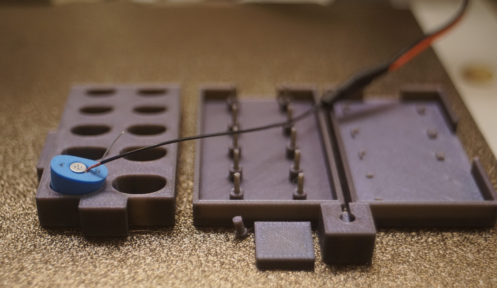

 # pirate-extensions-extended
Adapting AudioGroupCologne's Adaptions to the PIRATE In-Ear Microphones for electret micorphones and general headphone hobbyist use.

## Description
This repository contains additional supplementary materials for adapted in-ear microphones [1], based on the PIRATE microphones design by Denk et al. [2]

I strongly recommend reading both linked papers because this is just boiling down and stealing that work. o7 

## Contents

[Bill of Materials](Bill_of_Materials.md)

[Build Instructions](build_guide.md)

[Pirate Models](pirate-models)

The updated molds and guide tool support 3mm and 4mm electret capsules. Additionally, the original pirate extensions support a 3mm MEMS microphone. Note that only the top mold has been updated and the original center and base mold are still required. 

For a rough guide on how to use the microphones and create a personal target please see the [usage guide](usage_guide/usage_guide.md). Please expect the results to be confusing and problematic if you start this project. 

I've also setup a [graphtool](https://animegolem.github.io/) as an example of how this data may look once collected. This data should not be compared to any other rig and extreme caution should be used when drawing any conclusions. 

## REFERENCES

[1] D. Bau, O. Moschner, C. Poerschmann "Adapting the PIRATE Design for Cost-Effective In-Ear Microphones", Proceedings of the 50th DAGA, Hannover, Mar. 2024

[2] F. Denk, F. Brinkmann, A. Stirnemann, and B. Kollmeier, “The PIRATE: an anthropometric earPlug with exchangeable microphones for Individual Reliable Acquisition of Transfer functions at the Ear canal entrance”, Proceedings of the 45th DAGA, Rostock, Mar. 2019

