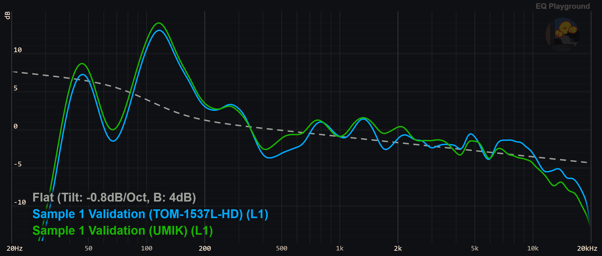
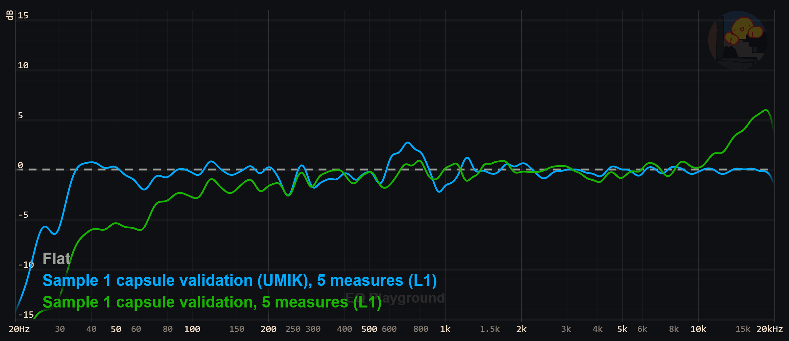
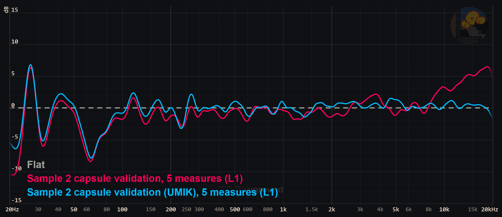
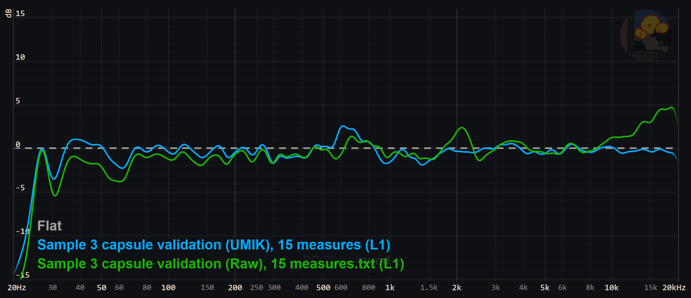
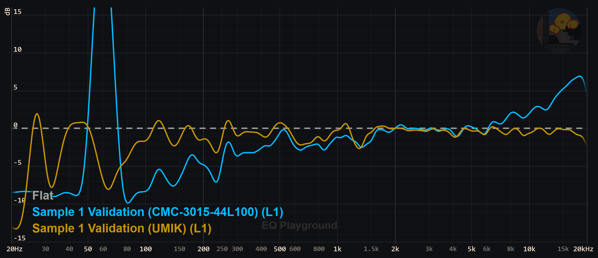

# TOM-1537L-HD-LW100-B-R

Current Recomendation 

# HBO0302C-58/1248

Sample 1 was problematic and showed massively increased LF roll off when in an ear. The mics are delicate and I've seen multiple die with no obvious cause.  

# CMC-3015-44L100

Very problematic mains hum. Generally poor linearity. 

