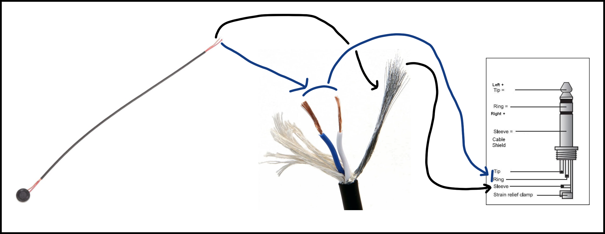

# Ear Plugs

1. Print the universal base, middle, and appropriate top mold based on the capsule you have chosen to use. Any filament should work but petg or nylon will be less likely to snap when demolding. Using a .08mm or smaller layer height may help if you have issues printing the pegs. 
2. Using a 2-Part kneadble silicone combine enough material to fill the mold. In my experience roughly 7 grams of each reagent is more than sufficent. Ensure mold is filled as tightly as possible. 
3. Carefully demold. You will likely have to trim excess with a razor. You want plugs that are completely smooth and have no overhang past the mold.  
4. Using a needle or similar make a hole from top to bottom on the plug above and below the electret. The top hole is a vent to release pressure and should be unobstructed. The bottom hole should be filled with superglue and a piece of .4mm monofilament. Cut this at a length you can saftely pull from the ear without yanking on the microphone leads. Generally 1-2cm should be sufficient.
5. Using something flat like a allen key push out a hole below the microphone standoff. This will be sealed during use but allow you to easily push out and remove the capsule without pulling the leads.

I do not advise using theear hooks as the original shape of the plugs is designed around the strain relief being oriented down from the ear. 

# Microphone
The Microphone must be glued to a standoff in order to be held in the earplug. This should be done using a 2 part epoxy or super glue. The provided guide tool is designed used with a 3mm electret but can be used with a 4mm if you increase the print scale to around 100.4.  

The actual microphone is very simple to construct. From the capsule bridge hot to both internal wires. On the TRS solder to either tip or bridge ring and tip if you'd like an output on both channels. It shouldn't really make a differnce either way. Use the sheathing as ground. 

